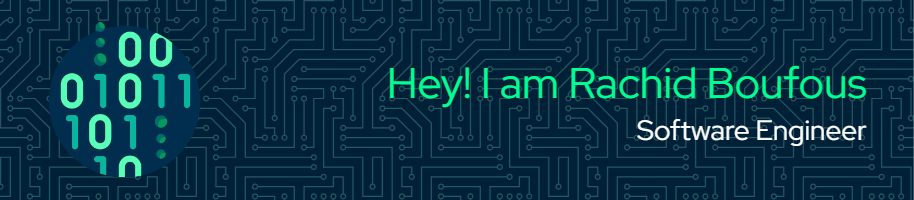

    

# About me:
- 🔭 I’m currently working on [Calleebree](https://www.calleebree.io) at [LAEDX](https://www.laedx.com/) and [TWISTAG](https://twistag.com/)
- 🌱 I’m currently experimenting with **RUST**  building <a href="https://github.com/RachidBoufous/candle" target="blank"> Candle🕯️- a terminal based text editor</a>
- 🤓 Ask me Anything, If i don't know the answer i will probably lie about it - but ask me anyway -

<!-- 

  
   -->

# Github Stats:

||  |
| ------------- | ------------- |

  

# Languages and Tools:

|Mobile|   |
| ------------- | ------------- |
|Programming Languages|  |
| ------------- | ------------- |

 

 
 

 

 

 
 
 
 
 
 

 
 
 
 
 
 

 
 
 
 
 
 
<alt="postman" width="40" height="40"/></a> 

 
 
 
 
 
 
 href="https://opencv.org/" target="_blank" rel="noreferrer"> </a> 
 
 

 
<a href="https://postman.com" target="_blank" rel="noreferrer"> 

<!--
**RachidBoufous/RachidBoufous** is a ✨ _special_ ✨ repository because its `README.md` (this file) appears on your GitHub profile.

Here are some ideas to get you started:

- 🔭 I’m currently working on ...
- 🌱 I’m currently learning ...
- 👯 I’m looking to collaborate on ...
- 🤔 I’m looking for help with ...
- 💬 Ask me about ...
- 📫 How to reach me: ...
- 😄 Pronouns: ...
- ⚡ Fun fact: ...
-->
